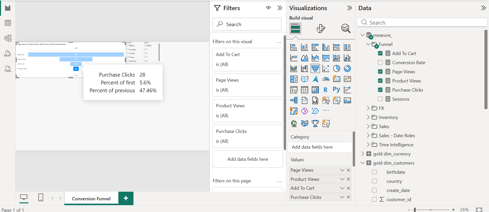

# Conversion Funnel

Built from `gold.fact_web_events`. One row per clickstream event, 500 browsing sessions.

## The funnel

| Stage | Events | Retained from previous | Lost |
|---|---|---|---|
| Page view | 500 | — | — |
| Product view | 193 | 38.6% | 307 |
| Add to cart | 59 | 30.6% | 134 |
| Purchase click | 28 | 47.5% | 31 |

**End to end: 5.6%.**

## What it says

**The browse stage is the biggest leak.** Three in five visitors never open a single product page. That is 307 people arriving and leaving without seeing anything to buy. Worth checking first because it is the largest absolute loss in the funnel.

**The cart stage loses most in proportion.** Only 30.6% of people who viewed a product added one, the weakest step in the funnel. Someone on a product page has intent; losing seven in ten means the page is not closing them. Price, delivery cost, stock availability or thin product detail.

**Checkout holds up best.** Nearly half of carts convert to a purchase click, well above typical retail. Whatever is wrong is happening before checkout, not at it.

## For the marketing team

1. **Fix the landing to product step.** Largest volume loss. Check paid traffic intent and whether search returns results. `search_term` on events with no following `product_view` names the failing queries directly.
2. **Then the product to cart step.** Weakest conversion. Cross against `fact_inventory`: if the most-viewed products are below reorder level, this is a stock problem, not a marketing one.
3. **Leave checkout alone for now.** It is performing.

## Diagnostics available in the model

- **By country.** `dim_customers` slices the funnel by market. Divergent conversion usually means shipping cost or currency display.
- **Identified against anonymous.** Roughly 70% of sessions carry no `customer_key`. If identified users convert better, the barrier is account friction.
- **Against sales.** Products with high views and low `fact_sales` revenue are pricing or description problems.

## Caveat

Clickstream events are generated by `generate_web_events.py` with configurable stage probabilities. This page demonstrates the measurement framework, not observed customer behaviour. Against production data the same measures would locate the real drop-off.
